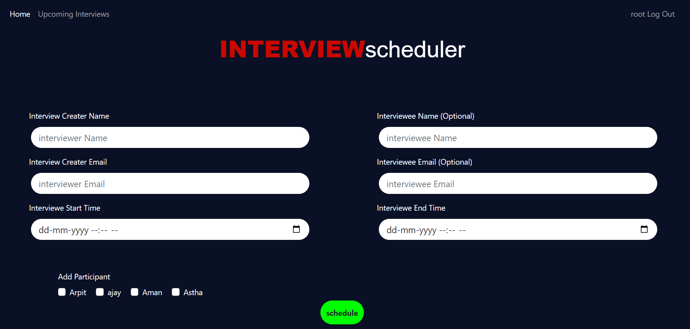

# Interview-Scheduler


## 🚀 Quick Start :

#### Step 1: Forking the repository :

To work on an open-source project, you will first need to make your copy of the repository. To do this, you should fork the repository and then clone it so that you have a local working copy.

Get your own Fork/Copy of repository by clicking `Fork` button right upper corner.<br><br>

#### Step 2: Clone the Forked Repository

After the repository is forked, you can now clone it so that you have a local working copy of the codebase.

To make your local copy of the repository follow the steps:
- Open the Command Prompt
- Type this command:
  
```bash
$ git clone https://github.com/<your-github-username>/pixelvibe
```


#### Step 3: Creating a new branch (IMP)
This is one of the very important step that you should follow to contribute in Open Source. A branch helps to manage the workflow, isolate your code and does not creates a mess. To create a new branch:
  
```bash
$ git branch <name_of_branch>
$ git checkout -b <name_of_branch>
```

Keep your cloned repo upto date by pulling from upstream (this will also avoid any merge conflicts while committing new changes)
```bash
git pull origin main
```

#### Step 4: Setting up Project

##### For Django:
**1. Create a Virtual Environment**

- *On macOS and Linux:*
  ```bash
    python3 -m venv env
  ```
- *Windows*
  ```bash
    py -m venv env
  ````

**2. Activate the Virtual Environment**
  - *On Windows*
    ```bash
    .\env\Scripts\activate
    ```
  - *On macOS and Linux:*
    ```bash
    source env/bin/activate
    ```

**3. Install dependencies using**
```bash
pip install -r requirements.txt
```

**4. Make Migrations**

```bash
  python manage.py makemigrations
  python manage.py migrate
```
**5. Run Server**

```bash
  python manage.py runserver
```
**6. Create admin**

```bash
  python manage.py createsuperuser
```

**5.** Go to ` http://127.0.0.1:8000/` and enjoy the application.


Current Features : 
1. mail about the interview to all the selected candidate with proper suject and body.

2.All the upcomming interviews can be views on the page /task.
- we have search feature in the table 
- we also have pagination in the table so it can hold 100+ schedules easily. 
<br>

`
For localhost : http://127.0.0.1:8000/task 
`

`
Live : https://interview-schedular-app.herokuapp.com/task/
`
<br>


3. Admin can  edit any schedule easily.
4. Admin can delete any schedule .
5. Normal user can create their account and login but only admin can schedule the interview.
6. Email Validation is implemented
7. Date validation is implemented
8. Admin can add one optional person as Interviewer also if he wants.
9. multiple interview at same time validation is also implemented so that no two interviews can be scheduled at same time.


Future ideas :
1. Send the mail to optional interviewer also.
2. send the meeting link also.
3. we can make a page for users to check their interviews scheduled for them.
4. some features like forgot password , reset password , otp verification , etc can be implemented.
5. we can make a field for uploading the resume also while signup.
6. change the resume after logging in.
7. fetch the users from backend instead of hardcode.


Database Schemas : 

it contains 3 tables

1. Users
- name 
- username'
- email
- password

2. Schedule
- id
- allcandidates
- intervieweStartTime
- intervieweEndTime
- interviewDate
- user(ForeignKey)

3. Candidates
- id
- name(ForeignKey of User)
- schedule_id(ForeignKey of schedule)